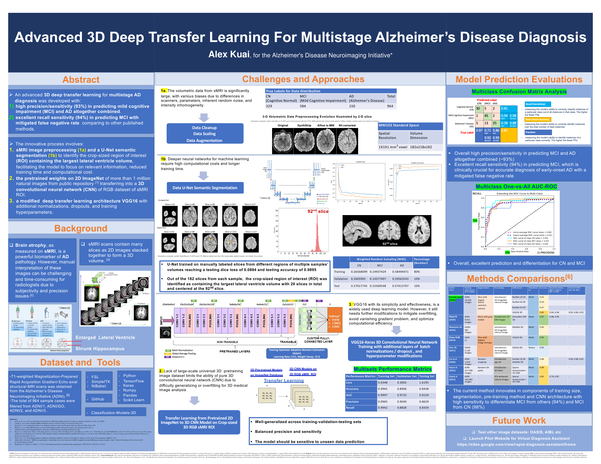

# Advanced 3D Deep Transfer Learning for Multistage Alzheimer's Disease Diagnosis

**Alex Kuai**, for the Alzheimer's Disease Neuroimaging Initiative\*

This repository holds the code behind my 2024 Massachusetts Science & Engineering Fair project. The project classifies structural MRI (sMRI) scans as **cognitively normal (CN)**, **mild cognitive impairment (MCI)**, or **Alzheimer's disease (AD)**. It does this with a 3D CNN that transfers ImageNet weights from 2D to 3D and is trained on a region of interest chosen by U-Net segmentation.

<p align="center">
  <a href="docs/poster/poster.pdf">
    
  </a>
  <br>
  <sub>Click the poster to open the full-resolution PDF, or <a href="https://github.com/AlexKuaiR/AlzheimersFLAIR/raw/main/docs/poster/poster.pdf"><b>download it here</b></a>.</sub>
</p>

---

## Highlights

- **93% precision and sensitivity** for predicting MCI and AD combined.
- **94% recall for MCI** compared with all other classes, and **98% for MCI vs. CN**. Catching MCI early matters clinically, because it keeps the false-negative rate low for early-onset AD.
- **84% test accuracy and 0.91 test AUC** in three-class classification, with balanced precision and recall across the training, validation, and test sets.
- Using U-Net to crop the volume to the slices with the **largest lateral ventricle volume** cuts training time and compute, and keeps the model focused on a known atrophy biomarker.

## Pipeline

The steps below follow the poster. Each step links to the notebook that implements it.

### 1a. sMRI preprocessing

Volumetric sMRI varies between scanners and acquisition settings, and it contains random noise and intensity inhomogeneity. Each scan goes through these steps:

| Step | What it does | Tool | Notebook |
|---|---|---|---|
| DICOM → NIfTI | Convert each ADNI DICOM series to a NIfTI volume | `dicom2nifti` | [`dcm2nifti.ipynb`](data-preprocessing/dcm2nifti.ipynb) |
| Brain extraction | Reorient to standard space and strip the skull (BET), then re-run failed cases with stronger settings | FSL `fslreorient2std`, `bet` | [`brain_extraction.ipynb`](data-preprocessing/brain_extraction.ipynb) |
| Spatial normalization | Register to the MNI152 1 mm template (182 × 218 × 182, 1 × 1 × 1 mm³ voxels) | FSL `flirt` | [`normalize2MNI152.ipynb`](data-preprocessing/normalize2MNI152.ipynb) |
| Bias-field correction | Remove intensity inhomogeneity | SimpleITK N4 | [`n4-bias-correction.ipynb`](data-preprocessing/n4-bias-correction.ipynb) |
| Split | Sort by diagnosis and split 80 / 10 / 10 into train / val / test | `split-folders` | [`volume-prep.ipynb`](3D-models/volume-prep.ipynb) |

> The preprocessing figure on the poster comes from a **public OpenNeuro scan** [7] run through the STAI sMRI pipeline [8]. It is only an illustration. The study's own pipeline (FSL BET + FLIRT + N4, shown above) differs slightly, and no participant scans appear anywhere in this repository or on the poster.

### 1b. Lateral ventricle ROI with U-Net

[`UNet.ipynb`](LateralVentricleSegmentation/UNet.ipynb) trains a U-Net [9] on manually labeled slices taken from several regions of many volumes. The labeling slices are exported in [`image-thresholding.ipynb`](2D-models/image-thresholding.ipynb). The U-Net reached a test Dice loss of **0.0884** and test accuracy of **0.9895**.

Each volume has 182 axial slices. The ROI is the **20 slices centered on slice 92**, which is where the lateral ventricles are largest. Enlarged ventricles and a shrunken hippocampus are hallmark signs of AD-related atrophy.

### 2. Transfer learning from 2D ImageNet to 3D

There is no large, general-purpose 3D pretraining dataset, so pure 3D CNNs tend to overfit on medical volumes. To work around this, [`3D-vgg-weights.ipynb`](3D-models/3D-vgg-weights.ipynb) inflates **VGG16 weights pretrained on ImageNet** (more than 1 million natural images) into a 3D CNN using `classification-models-3D` [1]. The ROI slices are stacked into a 3D RGB volume as the model input.

### 3. Modified VGG16 3D classifier

VGG16 is simple and effective, but it still overfits, has vanishing gradients, and is costly to train. To address this, the model:

- adds batch normalization and dropout to a new fully connected head;
- uses **weighted random sampling** to balance the classes in every batch;
- uses data augmentation and hyperparameter tuning (Adam optimizer).

VGG16 training experiments are in [`2D-models/vgg16-keras.ipynb`](2D-models/vgg16-keras.ipynb) and [`3D-models/vgg16-3d.ipynb`](3D-models/vgg16-3d.ipynb). Aggregate metrics and parameters for each VGG16 version are in [`2D-models/vgg16-results/`](2D-models/vgg16-results).

## Results

**Dataset.** 964 subjects from ADNI-1, ADNI-GO, ADNI-2, and ADNI-3 [5]:

| | CN | MCI | AD | Total |
|---|---:|---:|---:|---:|
| Subjects | 329 | 584 | 150 | 964 |

**Model performance** (modified 3D VGG16):

| Metric | Training | Validation | Testing |
|---|---:|---:|---:|
| Loss | 0.0348 | 0.3002 | 1.6195 |
| Accuracy | 0.9965 | 0.8906 | 0.8438 |
| AUC | 0.9997 | 0.9732 | 0.9129 |
| Precision | 0.9965 | 0.9040 | 0.8629 |
| Recall | 0.9942 | 0.8828 | 0.8359 |

The one-vs-all AUC-ROC is 0.95 for CN, 0.84 for AD, and 0.92 for MCI. The poster compares this work against published methods [6] on training size, segmentation, pretraining, and CNN architecture. It also shows the confusion matrix and ROC curves.

### Other architectures explored

I also tested many other models before choosing the 3D VGG16. They are kept here for reference:

- **2D slice models** ([`2D-models/`](2D-models)): VGG16/19, ResNet-18/50/50v2, DenseNet-121/201, Inception-v3, Inception-ResNet-v2, ConvNeXt-Base, SqueezeNet, EfficientNet-B3, and Vision Transformers (from scratch and pretrained), in both Keras and PyTorch.
- **3D volume models** ([`3D-models/`](3D-models)): a custom 3D CNN, 3D ResNet-18/34/50 (MONAI and MedicalNet weights), SE-ResNet-50, and EfficientNet-B3. In the 3D setting, the ResNet variants reached 0.45 to 0.53 accuracy, compared with 0.82 for VGG16 3D.

## Repository structure

```
├── data-preprocessing/            # DICOM → NIfTI, brain extraction, MNI152 registration, N4
├── LateralVentricleSegmentation/  # U-Net ROI segmentation
├── 3D-models/                     # 3D transfer learning (final model) + 3D baselines
│   └── other_results/             #   alternate training runs
├── 2D-models/                     # 2D slice-based experiments
│   └── vgg16-results/             #   aggregate metrics and parameters per VGG16 version
├── docs/poster/                   # poster (PDF + PNG)
└── requirements.txt
```

Every notebook opens with a short header that explains its purpose. Outputs were cleared before release. `3D-models/testing.ipynb` and `3D-models/fixed_notebook.ipynb` are scratch notebooks and not part of the pipeline.

## Reproducing the work

1. **Get the data.** Apply for ADNI access through the official [ADNI/LONI](https://adni.loni.usc.edu/) process. **No ADNI data are included here.**
2. **Install the tools.** Install [FSL](https://fsl.fmrib.ox.ac.uk/fsl/) (used for `bet`, `flirt`, and the MNI152 template), then install the Python packages:
   ```bash
   pip install -r requirements.txt
   ```
3. **Preprocess.** Run the notebooks in `data-preprocessing/` in the order listed above. Then run `3D-models/volume-prep.ipynb` to build the train/val/test split.
4. **Segment and train.** Train the U-Net in `LateralVentricleSegmentation/` to select the ROI, then train the classifier.

The notebooks use relative folder names (for example `ADNI-orig/`, `ADNI-nifti/`, and `Splitted/`), so place your local data to match. This repository shows the method and code. It cannot run end to end without approved data.

## Data availability and privacy

ADNI data-use restrictions mean this repository contains **no participant-level data**: no images, labels, subject IDs, processed arrays, predictions, or trained weights. Only aggregate metrics are reported. Every brain image on the poster comes from a public OpenNeuro dataset [7].

## Future work

- Test on other datasets, such as OASIS and AIBL.
- Launch a pilot [Virtual Diagnosis Assistant website](https://sites.google.com/view/rapid-diagnosis-assistant/home).

## References

1. Solovyev, R., et al. "3D convolutional neural networks for stalled brain capillary detection." *Computers in Biology and Medicine* 2022, 141, 105089.
2. Vemuri, P., et al. "Role of structural MRI in Alzheimer's disease." *Alzheimer's Research & Therapy* 2010, 2(23).
3. Breijyeh, Z., et al. "Comprehensive Review on Alzheimer's Disease: Causes and Treatment." *Molecules* 2020, 25(24), 5789.
4. Humera, T., et al. "Brain MRI literature review for interdisciplinary studies." *Biomedical Graphics and Computing* 2014, 4(4), 41.
5. Alzheimer's Disease Neuroimaging Initiative. https://adni.loni.usc.edu/
6. Methods comparison: Raza, N., et al. *Diagnostics* 2023, 13, 801; Maqsood, M., et al. *Sensors* 2019, 2645; Khan, N.M., et al. *IEEE Access* 2019, 7, 72726; Hon, M., et al. *IEEE BIBM* 2017, arXiv:1711.11117; Liu, S., et al. *PMLR* 116:184–201, 2020 (ML4H at NeurIPS 2019); Payan, A., et al. 2015, arXiv:1502.02506; Gupta, A., et al. *ICML* 2013, PMLR 28.
7. Taylor, P. N., Wang, Y., Simpson, C., Janiukstyte, V., Horsley, J., Leiberg, K., Little, B., Clifford, H., Adler, S., Vos, S. B., Winston, G. P., McEvoy, A. W., Miserocchi, A., de Tisi, J., & Duncan, J. S. (2024). *The Imaging Database for Epilepsy And Surgery (IDEAS)* (Version 1.0.0) [Dataset]. OpenNeuro. https://doi.org/10.18112/openneuro.ds005602.v1.0.0
8. Abbasi, M. H., & Adeli, E. (2025). *sMRI Processing Pipeline: A lightweight, end-to-end framework for BIDS-compatible structural MRI preprocessing and quality control* (Version 1.0.0). Stanford Translational AI Lab, Stanford University. Zenodo. https://doi.org/10.5281/zenodo.17503175
9. Ronneberger, O., Fischer, P., & Brox, T. "U-Net: Convolutional networks for biomedical image segmentation." *MICCAI* 2015, LNCS 9351, 234–241.

### Software and tools

- **FSL:** Jenkinson, M., Beckmann, C. F., Behrens, T. E. J., Woolrich, M. W., & Smith, S. M. (2012). FSL. *NeuroImage*, 62(2), 782–790. https://doi.org/10.1016/j.neuroimage.2011.09.015
- **FSL BET (brain extraction):** Smith, S. M. (2002). Fast robust automated brain extraction. *Human Brain Mapping*, 17(3), 143–155. https://doi.org/10.1002/hbm.10062
- **FSL FLIRT (registration):** Jenkinson, M., & Smith, S. (2001). A global optimisation method for robust affine registration of brain images. *Medical Image Analysis*, 5(2), 143–156. https://doi.org/10.1016/S1361-8415(01)00036-6; and Jenkinson, M., Bannister, P., Brady, M., & Smith, S. (2002). Improved optimization for the robust and accurate linear registration and motion correction of brain images. *NeuroImage*, 17(2), 825–841. https://doi.org/10.1006/nimg.2002.1132
- **N4 bias-field correction:** Tustison, N. J., Avants, B. B., Cook, P. A., Zheng, Y., Egan, A., Yushkevich, P. A., & Gee, J. C. (2010). N4ITK: Improved N3 bias correction. *IEEE Transactions on Medical Imaging*, 29(6), 1310–1320. https://doi.org/10.1109/TMI.2010.2046908
- **SynthStrip** (used in the illustrative pipeline [8]): Hoopes, A., Mora, J. S., Dalca, A. V., Fischl, B., & Hoffmann, M. (2022). SynthStrip: Skull-stripping for any brain image. *NeuroImage*, 260, 119474. https://doi.org/10.1016/j.neuroimage.2022.119474
- The project also uses SimpleITK, NiBabel, TensorFlow/Keras, PyTorch, MONAI, NumPy, pandas, scikit-learn, and [Classification-Models-3D](https://github.com/ZFTurbo/classification_models_3D). The STAI pipeline [8] also builds on FreeSurfer and TemplateFlow.

<details>
<summary><b>BibTeX for the illustration dataset and pipeline</b></summary>

```bibtex
@misc{taylor2024ideas,
  author    = {Taylor, Peter N. and Wang, Yujiang and Simpson, Callum and Janiukstyte, Vytene and Horsley, Jonathan and Leiberg, Karoline and Little, Beth and Clifford, Harry and Adler, Sophie and Vos, Sjoerd B. and Winston, Gavin P. and McEvoy, Andrew W. and Miserocchi, Anna and de Tisi, Jane and Duncan, John S.},
  title     = {The Imaging Database for Epilepsy And Surgery ({IDEAS})},
  year      = {2024},
  version   = {1.0.0},
  publisher = {OpenNeuro},
  doi       = {10.18112/openneuro.ds005602.v1.0.0}
}

@software{abbasi2025smri,
  author      = {Abbasi, Mohammad Hassan and Adeli, Ehsan},
  title       = {s{MRI} {P}rocessing {P}ipeline: A lightweight, end-to-end framework for {BIDS}-compatible structural {MRI} preprocessing and quality control},
  year        = {2025},
  version     = {1.0.0},
  institution = {Stanford Translational AI Lab, Stanford University},
  publisher   = {Zenodo},
  doi         = {10.5281/zenodo.17503175}
}
```

</details>

## Acknowledgments

\*Data used to prepare this project came from the Alzheimer's Disease Neuroimaging Initiative (ADNI) database ([adni.loni.usc.edu](https://adni.loni.usc.edu/)). The ADNI investigators contributed to the design and implementation of ADNI and/or provided data, but did not take part in the analysis or in writing this report. A complete list of ADNI investigators is available [here](http://adni.loni.usc.edu/wp-content/uploads/how_to_apply/ADNI_Acknowledgement_List.pdf).

Data collection and sharing for this project was funded by the Alzheimer's Disease Neuroimaging Initiative (ADNI) (National Institutes of Health Grant U01 AG024904) and DOD ADNI (Department of Defense award number W81XWH-12-2-0012). ADNI is funded by the National Institute on Aging, the National Institute of Biomedical Imaging and Bioengineering, and through generous contributions from the following: AbbVie, Alzheimer's Association; Alzheimer's Drug Discovery Foundation; Araclon Biotech; BioClinica, Inc.; Biogen; Bristol-Myers Squibb Company; CereSpir, Inc.; Cogstate; Eisai Inc.; Elan Pharmaceuticals, Inc.; Eli Lilly and Company; EuroImmun; F. Hoffmann-La Roche Ltd and its affiliated company Genentech, Inc.; Fujirebio; GE Healthcare; IXICO Ltd.; Janssen Alzheimer Immunotherapy Research & Development, LLC.; Johnson & Johnson Pharmaceutical Research & Development LLC.; Lumosity; Lundbeck; Merck & Co., Inc.; Meso Scale Diagnostics, LLC.; NeuroRx Research; Neurotrack Technologies; Novartis Pharmaceuticals Corporation; Pfizer Inc.; Piramal Imaging; Servier; Takeda Pharmaceutical Company; and Transition Therapeutics. The Canadian Institutes of Health Research is providing funds to support ADNI clinical sites in Canada. Private sector contributions are facilitated by the Foundation for the National Institutes of Health (www.fnih.org). The grantee organization is the Northern California Institute for Research and Education, and the study is coordinated by the Alzheimer's Therapeutic Research Institute at the University of Southern California. ADNI data are disseminated by the Laboratory for Neuro Imaging at the University of Southern California.

## Disclaimer

This project is for educational and research purposes only. It is not a clinical diagnostic tool.
